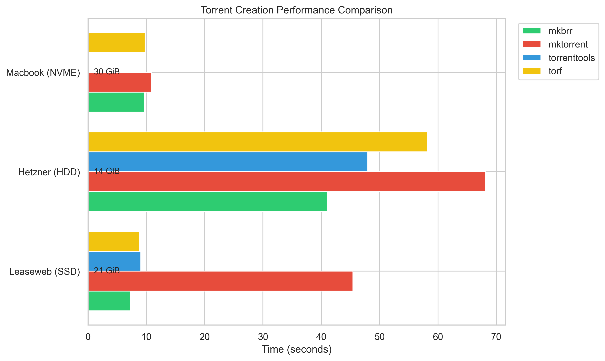
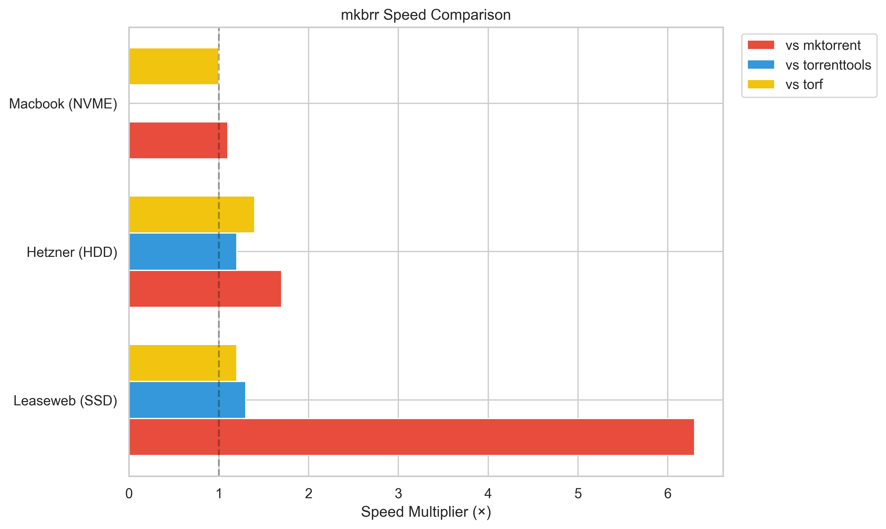
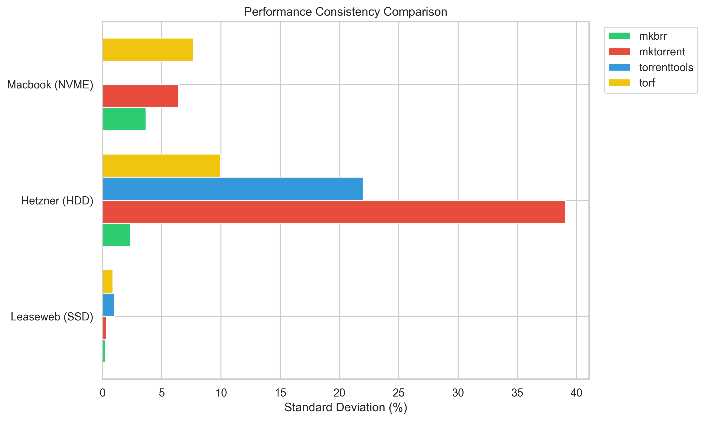

# mkbrr

```
         __   ___.                 
  _____ |  | _\_ |________________ 
 /     \|  |/ /| __ \_  __ \_  __ \
|  Y Y  \    < | \_\ \  | \/|  | \/
|__|_|  /__|_ \|___  /__|   |__|   
      \/     \/    \/              

mkbrr is a tool to create and inspect torrent files.

Usage:
  mkbrr [command]

Available Commands:
  create      Create a new torrent file
  inspect     Inspect a torrent file
  modify      Modify existing torrent files using a preset
  update      Update mkbrr
  version     Print version information
  help        Help about any command

Flags:
  -h, --help   help for mkbrr

Use "mkbrr [command] --help" for more information about a command.
```

## What is mkbrr?

**mkbrr** (pronounced "make-burr") is a simple yet powerful tool for:
- Creating torrent files
- Inspecting torrent files
- Modifying torrent metadata
- Supports tracker-specific requirements automatically

**Why use mkbrr?**
- 🚀 **Fast**: Blazingly fast hashing beating the competition
- 🔧 **Simple**: Easy to use CLI
- 📦 **Portable**: Single binary with no dependencies
- 💡 **Smart**: Will attempt to detect possible missing files when creating torrents for season packs

## Quick Start

### Install

#### Pre-built binaries

Download a ready-to-use binary for your platform from the [releases page](https://github.com/autobrr/mkbrr/releases).

#### Homebrew

```bash
brew tap autobrr/mkbrr
brew install mkbrr
```

### Creating a Torrent

```bash
# torrents are private by default
mkbrr create path/to/file -t https://example-tracker.com/announce

# public torrent
mkbrr create path/to/file -t https://example-tracker.com/announce --private=false

# Create with randomized info hash
mkbrr create path/to/file -t https://example-tracker.com/announce -e
```

## Table of Contents

- [Installation](#installation)
- [Usage](#usage)
  - [Creating Torrents](#creating-torrents)
  - [Inspecting Torrents](#inspecting-torrents)
  - [Modifying Torrents](#modifying-torrents)
- [Advanced Usage](#advanced-usage)
  - [Preset Mode](#preset-mode)
  - [Batch Mode](#batch-mode)
- [Tracker-Specific Features](#tracker-specific-features)
- [Incomplete Season Pack Detection](#incomplete-season-pack-detection)
- [Performance](#performance)
  - [Benchmark Methodology](#benchmark-methodology)
  - [Benchmark Results](#benchmark-results)
  - [Speed Comparison](#speed-comparison)
  - [Consistency](#consistency)
  - [Hardware Specifications](#hardware-specifications)
- [License](#license)

## Installation

Choose the method that works best for you:

### Prebuilt Binaries

Download a ready-to-use binary for your platform from the [releases page](https://github.com/autobrr/mkbrr/releases).

### Homebrew (macOS and Linux)

```bash
brew tap autobrr/mkbrr
brew install mkbrr
```

### Build from Source

Requirements:
See [go.mod](https://github.com/autobrr/mkbrr/blob/main/go.mod#L3) for Go version.

```bash
# Clone the repository
git clone https://github.com/autobrr/mkbrr.git
cd mkbrr

# Install the binary to $GOPATH/bin
make install

# Or install system-wide (requires sudo)
sudo make install    # installs to /usr/local/bin
```

### Go Install

If you have Go installed:

```bash
go install github.com/autobrr/mkbrr@latest

# make sure its in your PATH
export PATH=$PATH:$(go env GOPATH)/bin
```

## Usage

### Creating Torrents

The basic command structure for creating torrents is:

```bash
mkbrr create [path] [flags]
```

For help:

```bash
mkbrr create --help
```

#### Basic Examples

```bash
# Create a private torrent (default)
mkbrr create path/to/file -t https://example-tracker.com/announce

# Create a public torrent
mkbrr create path/to/file -t https://example-tracker.com/announce --private=false

# Create with a comment
mkbrr create path/to/file -t https://example-tracker.com/announce -c "My awesome content"

# Create with a custom output path
mkbrr create path/to/file -t https://example-tracker.com/announce -o custom-name.torrent

# Create with randomized info hash
mkbrr create path/to/file -t https://example-tracker.com/announce -e

# Create a torrent excluding specific file patterns (comma-separated)
mkbrr create path/to/file -t https://example-tracker.com/announce --exclude "*.nfo,*.jpg"

# Create a torrent including only specific file patterns (comma-separated)
mkbrr create path/to/video-folder -t https://example-tracker.com/announce --include "*.mkv,*.mp4"
```

> [!NOTE]
> The exclude and include patterns feature supports standard glob pattern matching (like `*` for any number of characters, `?` for a single character) and is case-insensitive.
> **Precedence:** Inclusion patterns (`--include`) take precedence.
> - If `--include` is used:
>   - A file matching an `--include` pattern is **always kept**, even if it also matches an `--exclude` pattern.
>   - A file *not* matching any `--include` pattern is **always ignored**.
> - If `--include` is *not* used, then only `--exclude` patterns are considered, and matching files are ignored.

### Inspecting Torrents

View detailed information about a torrent:

```bash
mkbrr inspect my-torrent.torrent
```

This shows:
- Name and size
- Piece information and hash
- Tracker URLs
- Creation date
- File list (for multi-file torrents)

### Modifying Torrents

Update metadata in existing torrent files without access to the original content:

```bash
# Basic usage
mkbrr modify original.torrent --tracker https://new-tracker.com

# Modify multiple torrents
mkbrr modify *.torrent --private=false

# See what would be changed without making actual changes
mkbrr modify original.torrent --tracker https://new-tracker.com --dry-run

# Randomize info hash
mkbrr modify original.torrent -e
```

## Advanced Usage

### Preset Mode

Presets save you time by storing commonly used settings. Great for users who create torrents for the same trackers regularly.

See [presets example](examples/presets.yaml) here.

```bash
# Uses the ptp-preset (defined in your presets.yaml file)
mkbrr create -P ptp path/to/file

# Override some preset values
mkbrr create -P ptp --source "MySource" path/to/file
```

> [!TIP]
> The preset file can be placed in the current directory, `~/.config/mkbrr/`, or `~/.mkbrr/`. You can also specify a custom location with `--preset-file`. Presets support both `exclude_patterns` and `include_patterns` fields, allowing you to define default or preset-specific file filtering.

### Batch Mode

Create multiple torrents at once using a YAML configuration file:

```bash
mkbrr create -b batch.yaml
```

See [batch example](examples/batch.yaml) here.

> [!TIP]
> Batch mode processes jobs in parallel (up to 4 at once) and shows a summary when complete. Batch mode also supports both `exclude_patterns` and `include_patterns` fields.

## Tracker-Specific Features

mkbrr automatically enforces some requirements for various private trackers so you don't have to:

#### Piece Length Limits

Different trackers have different requirements:
- HDB, BHD, SuperBits: Max 16 MiB pieces
- Emp, MTV: Max 8 MiB pieces
- GazelleGames: Max 64 MiB pieces

#### Torrent Size Limits

Some trackers limit the size of the .torrent file itself:
- Anthelion: 250 KiB
- GazelleGames: 1 MB

> [!INFO]
> When creating torrents for these trackers, mkbrr automatically adjusts piece sizes to meet requirements, so you don't have to.

A full overview over tracker-specific limits can be seen in [trackers.go](internal/trackers/trackers.go)

## Incomplete Season Pack Detection

If the input is a folder with a name that indicates that its a pack, it will find the highest number and do a count to look for missing files.

```
mkbrr create ~/Kyles.Original.Sins.S01.1080p.SRC.WEB-DL.DDP5.1.H.264 -t https://tracker.com/announce/1234567

Files being hashed:
  ├─ Kyles.Original.Sins.S01E01.Business.and.Pleasure.1080p.SRC.WEB-DL.DDP5.1.H.264.mkv (3.3 GiB)
  ├─ Kyles.Original.Sins.S01E02.Putting.It.Back.In.1080p.SRC.WEB-DL.DDP5.1.H.264.mkv (3.4 GiB)
  └─ Kyles.Original.Sins.S01E04.Cursor.For.Life.1080p.SRC.WEB-DL.DDP5.1.H.264.mkv (3.3 GiB)


Warning: Possible incomplete season pack detected
  Season number: 1
  Highest episode number found: 4
  Video files: 3

This may be an incomplete season pack. Check files before uploading.

Hashing pieces... [3220.23 MB/s] 100% [========================================]

Wrote title.torrent (elapsed 3.22s)
```


## Performance

mkbrr is optimized for speed and consistently outperforms other popular torrent creation tools in our benchmarks.

### Benchmark Methodology

All tests were performed using [hyperfine](https://github.com/sharkdp/hyperfine) with 5 runs per tool after a warm-up run. Cache was cleared between runs on the servers, but not on the Macbook.

### Benchmark Results

| Hardware | Test Size | mkbrr | mktorrent | torrenttools | torf |
|----------|---------------|-------|-----------|--------------|------|
| **Leaseweb Server (SSD)** | 21 GiB | **7.24s** | 45.41s | 9.07s | 8.85s |
| **Hetzner Server (HDD)** | 14 GiB | **41.02s** | 68.17s | 47.97s | 58.19s |
| **Macbook Pro M4 (NVME)** | 30 GiB | **9.71s** | 10.90s | - | 9.78s |



### Speed Comparison

| Hardware | vs mktorrent | vs torrenttools | vs torf |
|----------|-------------|----------------|---------|
| **Leaseweb Server (SSD)** | 6.3× faster | 1.3× faster | 1.2× faster |
| **Hetzner Server (HDD)** | 1.7× faster | 1.2× faster | 1.4× faster |
| **Macbook Pro M4 (NVME)** | 1.1× faster | - | Similar |



### Consistency

Besides raw speed, mkbrr shows more consistent performance between runs, with standard deviation percentages between 0.25-3.7% across platforms compared to much higher variances for other tools (up to 39%). This predictable performance is particularly noticeable on mechanical storage where other tools showed wider fluctuations.



### Hardware Specifications

#### Leaseweb Dedicated Server (SSD)
- CPU: Intel Xeon E-2274G @ 4.00GHz
- RAM: 32GB
- Storage: 1 × SAMSUNG MZQL21T9HCJR-00A07 1.92TB SSD

#### Hetzner Dedicated Server (HDD)
- CPU: AMD Ryzen 5 3600 (12) @ 4.71GHz
- RAM: 64GB
- Storage: 4 × TOSHIBA MG08ACA16TEY in RAID0

#### Macbook Pro M4
- CPU: Apple M4
- RAM: 16GB
- Storage: 512GB NVME

### Full results

<details>
<summary>View Full Benchmark Commands & Results</summary>

#### Leaseweb Server (21 GiB 1080p season pack)

```bash
hyperfine --warmup 1 --runs 5 \
  --setup 'sudo sync && sudo sh -c "echo 3 > /proc/sys/vm/drop_caches"' \
  --prepare 'sudo sync && sudo sh -c "echo 3 > /proc/sys/vm/drop_caches" && rm -f /home/user/Show.S01.DL.1080p.WEB.H264-GROUP.torrent' \
  'mkbrr create /home/user/torrents/qbittorrent/Show.S01.DL.1080p.WEB.H264-GROUP' \
  'mktorrent /home/user/torrents/qbittorrent/Show.S01.DL.1080p.WEB.H264-GROUP' \
  'torrenttools create --threads 8 ~/torrents/qbittorrent/Show.S01.DL.1080p.WEB.H264-GROUP' \
  'torf --threads 8 /home/user/torrents/qbittorrent/Show.S01.DL.1080p.WEB.H264-GROUP'

Benchmark 1: mkbrr create /home/user/torrents/qbittorrent/Show.S01.DL.1080p.WEB.H264-GROUP
  Time (mean ± σ):      7.244 s ±  0.018 s    [User: 31.245 s, System: 7.554 s]
  Range (min … max):    7.225 s …  7.270 s    5 runs

Benchmark 2: mktorrent /home/user/torrents/qbittorrent/Show.S01.DL.1080p.WEB.H264-GROUP
  Time (mean ± σ):     45.407 s ±  0.163 s    [User: 36.495 s, System: 4.983 s]
  Range (min … max):   45.135 s … 45.539 s    5 runs

Benchmark 3: torrenttools create --threads 8 ~/torrents/qbittorrent/Show.S01.DL.1080p.WEB.H264-GROUP
  Time (mean ± σ):      9.074 s ±  0.093 s    [User: 29.248 s, System: 5.228 s]
  Range (min … max):    8.908 s …  9.122 s    5 runs

Benchmark 4: torf --threads 8 /home/user/torrents/qbittorrent/Show.S01.DL.1080p.WEB.H264-GROUP
  Time (mean ± σ):      8.854 s ±  0.077 s    [User: 25.829 s, System: 5.136 s]
  Range (min … max):    8.771 s …  8.937 s    5 runs

Summary
  'mkbrr create /home/user/torrents/qbittorrent/Show.S01.DL.1080p.WEB.H264-GROUP' ran
    1.22 ± 0.01 times faster than 'torf --threads 8 /home/user/torrents/qbittorrent/Show.S01.DL.1080p.WEB.H264-GROUP'
    1.25 ± 0.01 times faster than 'torrenttools create --threads 8 ~/torrents/qbittorrent/Show.S01.DL.1080p.WEB.H264-GROUP'
    6.27 ± 0.03 times faster than 'mktorrent /home/user/torrents/qbittorrent/Show.S01.DL.1080p.WEB.H264-GROUP'
```

#### Hetzner Server (14 GiB 1080p season pack)

```bash
hyperfine --warmup 1 --runs 5 \
  --setup 'sudo sync && sudo sh -c "echo 3 > /proc/sys/vm/drop_caches"' \
  --prepare 'sudo sync && sudo sh -c "echo 3 > /proc/sys/vm/drop_caches" && rm -f /home/user/mkbrr/Show.S01.1080p.SRC.WEB-DL.DDP5.1.H.264-GRP.torrent' \
  'mkbrr create ~/torrents/qbittorrent/tv/Show.S01.1080p.SRC.WEB-DL.DDP5.1.H.264-GRP' \
  'mktorrent ~/torrents/qbittorrent/tv/Show.S01.1080p.SRC.WEB-DL.DDP5.1.H.264-GRP' \
  'torrenttools create --threads 12 ~/torrents/qbittorrent/tv/Show.S01.1080p.SRC.WEB-DL.DDP5.1.H.264-GRP' \
  'torf --threads 12 ~/torrents/qbittorrent/tv/Show.S01.1080p.SRC.WEB-DL.DDP5.1.H.264-GRP'

Benchmark 1: mkbrr create ~/torrents/qbittorrent/tv/Show.S01.1080p.SRC.WEB-DL.DDP5.1.H.264-GRP
  Time (mean ± σ):     41.022 s ±  0.979 s    [User: 13.691 s, System: 6.747 s]
  Range (min … max):   39.938 s … 42.467 s    5 runs

Benchmark 2: mktorrent ~/torrents/qbittorrent/tv/Show.S01.1080p.SRC.WEB-DL.DDP5.1.H.264-GRP
  Time (mean ± σ):     68.168 s ± 26.654 s    [User: 17.934 s, System: 6.543 s]
  Range (min … max):   39.268 s … 97.574 s    5 runs

Benchmark 3: torrenttools create --threads 12 ~/torrents/qbittorrent/tv/Show.S01.1080p.SRC.WEB-DL.DDP5.1.H.264-GRP
  Time (mean ± σ):     47.968 s ± 10.552 s    [User: 7.052 s, System: 6.551 s]
  Range (min … max):   39.460 s … 66.296 s    5 runs

Benchmark 4: torf --threads 12 ~/torrents/qbittorrent/tv/Show.S01.1080p.SRC.WEB-DL.DDP5.1.H.264-GRP
  Time (mean ± σ):     58.187 s ±  5.787 s    [User: 7.185 s, System: 6.511 s]
  Range (min … max):   50.125 s … 65.807 s    5 runs

Summary
  mkbrr create ~/torrents/qbittorrent/tv/Show.S01.1080p.SRC.WEB-DL.DDP5.1.H.264-GRP ran
    1.17 ± 0.26 times faster than torrenttools create --threads 12 ~/torrents/qbittorrent/tv/Show.S01.1080p.SRC.WEB-DL.DDP5.1.H.264-GRP
    1.42 ± 0.15 times faster than torf --threads 12 ~/torrents/qbittorrent/tv/Show.S01.1080p.SRC.WEB-DL.DDP5.1.H.264-GRP
    1.66 ± 0.65 times faster than mktorrent ~/torrents/qbittorrent/tv/Show.S01.1080p.SRC.WEB-DL.DDP5.1.H.264-GRP
```

#### Macbook Pro M4 (30 GiB 1080p season pack)

```bash
hyperfine --warmup 1 --runs 5 \
  --prepare 'rm -f Show.S01.1080p.SRC.WEB-DL.DDP5.1.H.264-GRP.torrent' \
  'mkbrr create ~/Desktop/Show.S01.1080p.SRC.WEB-DL.DDP5.1.H.264-GRP' \
  'mktorrent ~/Desktop/Show.S01.1080p.SRC.WEB-DL.DDP5.1.H.264-GRP' \
  'torf --threads 10 ~/Desktop/Show.S01.1080p.SRC.WEB-DL.DDP5.1.H.264-GRP'

Benchmark 1: mkbrr create ~/Desktop/Show.S01.1080p.SRC.WEB-DL.DDP5.1.H.264-GRP
  Time (mean ± σ):      9.708 s ±  0.355 s    [User: 10.823 s, System: 4.297 s]
  Range (min … max):    9.479 s … 10.323 s    5 runs

Benchmark 2: mktorrent ~/Desktop/Show.S01.1080p.SRC.WEB-DL.DDP5.1.H.264-GRP
  Time (mean ± σ):     10.897 s ±  0.701 s    [User: 11.021 s, System: 3.038 s]
  Range (min … max):    9.950 s … 11.620 s    5 runs

Benchmark 3: torf --threads 10 ~/Desktop/Show.S01.1080p.SRC.WEB-DL.DDP5.1.H.264-GRP
  Time (mean ± σ):      9.779 s ±  0.749 s    [User: 10.776 s, System: 5.253 s]
  Range (min … max):    9.383 s … 11.112 s    5 runs

Summary
  mkbrr create ~/Desktop/Show.S01.1080p.SRC.WEB-DL.DDP5.1.H.264-GRP ran
    1.01 ± 0.09 times faster than torf --threads 10 ~/Desktop/Show.S01.1080p.SRC.WEB-DL.DDP5.1.H.264-GRP
    1.12 ± 0.08 times faster than mktorrent ~/Desktop/Show.S01.1080p.SRC.WEB-DL.DDP5.1.H.264-GRP
```
</details>

## License

This program is free software; you can redistribute it and/or modify it under the terms of the GNU General Public License as published by the Free Software Foundation; either version 2 of the License, or (at your option) any later version.

See [LICENSE](LICENSE) for the full license text.